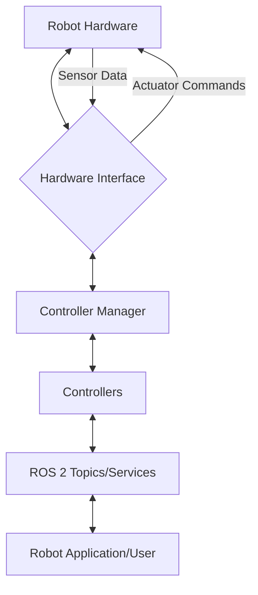

# Chapter 4: Advanced ROS 2 for Humanoid Control

This chapter delves into advanced aspects of ROS 2 for controlling humanoid robots, focusing on real-time performance, control interfaces, and sensor/actuator integration.

## ROS 2 Control Interfaces (ros2_control)

`ros2_control` is a framework for controlling robots with ROS 2. It provides a structured way to manage robot hardware, allowing developers to easily switch between different control algorithms and hardware configurations.

### Architecture Overview

The `ros2_control` framework consists of several key components:

-   **Hardware Interface**: This component communicates directly with the robot's hardware (motors, sensors). It reads sensor data and sends commands to actuators.
-   **Controller Manager**: Manages and orchestrates various controllers. It can load, unload, start, and stop controllers dynamically.
-   **Controllers**: Implement specific control algorithms (e.g., position control, velocity control, joint trajectory control).
-   **URDF/XACRO**: Robot description format used to define the robot's kinematics, dynamics, and control interfaces.



### Implementing a Hardware Interface

To integrate a humanoid robot with `ros2_control`, you need to implement a custom hardware interface that adheres to the `ros2_control` API. This involves defining how to read sensor states and how to command actuator positions/velocities/efforts.

```cpp
// Example: Minimal hardware interface for a single joint (conceptual)
#include "hardware_interface/system_interface.hpp"
#include "rclcpp/rclcpp.hpp"

class MyHumanoidHardware : public hardware_interface::SystemInterface
{
public:
  // ... constructor and other methods ...

  hardware_interface::CallbackReturn on_init(const hardware_interface::HardwareInfo & info) override
  {
    // Initialize communication with actual hardware
    // Parse URDF to get joint names, limits, etc.
    return hardware_interface::CallbackReturn::SUCCESS;
  }

  hardware_interface::CallbackReturn on_activate(const rclcpp_lifecycle::State & previous_state) override
  {
    // Start hardware communication
    return hardware_interface::CallbackReturn::SUCCESS;
  }

  std::vector<hardware_interface::StateInterface> export_state_interfaces() override
  {
    // Export state interfaces (e.g., joint position, velocity)
    std::vector<hardware_interface::StateInterface> state_interfaces;
    state_interfaces.emplace_back("joint1", "position", &joint_position_);
    return state_interfaces;
  }

  std::vector<hardware_interface::CommandInterface> export_command_interfaces() override
  {
    // Export command interfaces (e.g., joint position command)
    std::vector<hardware_interface::CommandInterface> command_interfaces;
    command_interfaces.emplace_back("joint1", "position", &joint_command_);
    return command_interfaces;
  }

  hardware_interface::CallbackReturn on_read(const rclcpp::Time & time, const rclcpp::Duration & period) override
  {
    // Read sensor data from hardware
    // Update joint_position_
    return hardware_interface::CallbackReturn::SUCCESS;
  }

  hardware_interface::CallbackReturn on_write(const rclcpp::Time & time, const rclcpp::Duration & period) override
  {
    // Write command data to hardware
    // Use joint_command_ to send commands
    return hardware_interface::CallbackReturn::SUCCESS;
  }

private:
  double joint_position_;
  double joint_command_;
};
```

## Real-time Considerations in ROS 2

Achieving real-time performance is crucial for precise and safe humanoid robot control. ROS 2, with its DDS (Data Distribution Service) middleware, offers better real-time capabilities than ROS 1.

### Real-time Operating Systems (RTOS)

Using an RTOS like Xenomai, PREEMPT_RT patch for Linux, or QNX is essential for guaranteeing predictable execution times.

-   **PREEMPT_RT**: A patch for the Linux kernel that reduces latency and jitter, making standard Linux more suitable for real-time applications.
-   **Xenomai**: A co-kernel that runs alongside Linux, providing a hard real-time environment.

### ROS 2 Real-time Best Practices

-   **Executor Selection**: Use single-threaded executors for critical control loops to avoid unpredictable thread scheduling.
-   **Memory Pre-allocation**: Pre-allocate memory to avoid dynamic memory allocations during real-time loops, which can introduce latency.
-   **Prioritization**: Set appropriate thread priorities for control nodes.
-   **Lock-free Programming**: Minimize or eliminate locks in real-time critical sections.
-   **DDS Configuration**: Tune DDS parameters (e.g., quality of service settings like `reliable` vs. `best_effort`, `durability`, `history`) for optimal real-time communication.

## Integrating Sensors and Actuators with ROS 2

Humanoid robots rely on a variety of sensors (IMUs, force sensors, encoders, cameras, LiDAR) and actuators (servo motors, series elastic actuators).

### Sensor Data Processing

Sensor data needs to be acquired, filtered, and published as ROS 2 messages.

```python
# Python example: IMU data processing and publishing
import rclpy
from rclpy.node import Node
from sensor_msgs.msg import Imu
import numpy as np

class ImuProcessor(Node):
    def __init__(self):
        super().__init__('imu_processor')
        self.publisher_ = self.create_publisher(Imu, 'humanoid/imu', 10)
        self.timer = self.create_timer(0.01, self.publish_imu_data) # 100 Hz

        # Simulate IMU data (replace with actual hardware reading)
        self.acceleration_x = 0.0
        self.angular_velocity_z = 0.0

    def read_imu_hardware(self):
        # In a real robot, this would read from the IMU sensor
        # For simulation, we'll just increment some values
        self.acceleration_x += np.random.normal(0, 0.01)
        self.angular_velocity_z += np.random.normal(0, 0.005)
        return self.acceleration_x, 0.0, 0.0, 0.0, 0.0, self.angular_velocity_z

    def publish_imu_data(self):
        msg = Imu()
        msg.header.stamp = self.get_clock().now().to_msg()
        msg.header.frame_id = 'base_link'

        accel_x, accel_y, accel_z, ang_vel_x, ang_vel_y, ang_vel_z = self.read_imu_hardware()

        msg.linear_acceleration.x = accel_x
        msg.linear_acceleration.y = accel_y
        msg.linear_acceleration.z = accel_z
        msg.angular_velocity.x = ang_vel_x
        msg.angular_velocity.y = ang_vel_y
        msg.angular_velocity.z = ang_vel_z

        self.publisher_.publish(msg)
        self.get_logger().info(f'Publishing IMU: Linear Accel X={msg.linear_acceleration.x:.2f}, Angular Vel Z={msg.angular_velocity.z:.2f}')

def main(args=None):
    rclpy.init(args=args)
    imu_processor = ImuProcessor()
    rclpy.spin(imu_processor)
    imu_processor.destroy_node()
    rclpy.shutdown()

if __name__ == '__main__':
    main()
```

### Actuator Control

Actuators receive commands (position, velocity, effort) from controllers. It's important to handle feedback and error checking.

```python
# Python example: Actuator command subscriber (conceptual)
import rclpy
from rclpy.node import Node
from std_msgs.msg import Float64

class ActuatorController(Node):
    def __init__(self):
        super().__init__('actuator_controller')
        self.subscription = self.create_subscription(
            Float64,
            'humanoid/joint_commands/left_leg_joint',
            self.joint_command_callback,
            10)
        self.subscription  # prevent unused variable warning
        self.current_joint_position = 0.0

    def joint_command_callback(self, msg):
        commanded_position = msg.data
        self.get_logger().info(f'Received command for left_leg_joint: {commanded_position:.2f}')
        # In a real robot, send this command to the actual actuator
        # e.g., via a serial interface, CAN bus, or EtherCAT
        self.current_joint_position = commanded_position
        # Simulate actuator movement and read actual position feedback
        # For simplicity, assume it reaches the commanded position instantly
        self.get_logger().info(f'Actuator moved to: {self.current_joint_position:.2f}')

def main(args=None):
    rclpy.init(args=args)
    actuator_controller = ActuatorController()
    rclpy.spin(actuator_controller)
    actuator_controller.destroy_node()
    rclpy.shutdown()

if __name__ == '__main__':
    main()
```

## Python Code Examples for Advanced Control Loops and Sensor Data Processing

### Joint Position PID Control Loop

A classic PID (Proportional-Integral-Derivative) controller is fundamental for achieving desired joint positions.

```python
# Python example: ROS 2 PID controller for a single joint
import rclpy
from rclpy.node import Node
from std_msgs.msg import Float64
from rclpy.qos import QoSProfile, ReliabilityPolicy, HistoryPolicy

class PidJointController(Node):
    def __init__(self):
        super().__init__('pid_joint_controller')

        # QoS profile for real-time control
        qos_profile = QoSProfile(
            reliability=ReliabilityPolicy.BEST_EFFORT,
            history=HistoryPolicy.KEEP_LAST,
            depth=1
        )

        # PID gains
        self.kp = 10.0
        self.ki = 0.1
        self.kd = 0.5

        self.setpoint = 0.0 # Desired joint position
        self.current_position = 0.0 # Actual joint position (from sensor feedback)

        self.error_sum = 0.0
        self.last_error = 0.0
        self.last_time = self.get_clock().now()

        # Publishers and Subscribers
        self.setpoint_sub = self.create_subscription(
            Float64,
            'humanoid/joint_setpoint',
            self.setpoint_callback,
            qos_profile)
        self.position_sub = self.create_subscription(
            Float64,
            'humanoid/joint_feedback', # From encoder/potentiometer
            self.position_callback,
            qos_profile)
        self.command_pub = self.create_publisher(
            Float64,
            'humanoid/joint_command', # To motor driver
            qos_profile)

        self.control_timer = self.create_timer(0.01, self.control_loop) # 100 Hz control loop

        self.get_logger().info("PID Joint Controller Initialized")

    def setpoint_callback(self, msg):
        self.setpoint = msg.data
        self.get_logger().info(f"Setpoint updated to: {self.setpoint:.2f}")

    def position_callback(self, msg):
        self.current_position = msg.data
        # self.get_logger().info(f"Current position feedback: {self.current_position:.2f}")

    def control_loop(self):
        current_time = self.get_clock().now()
        dt_duration = current_time - self.last_time
        dt = dt_duration.nanoseconds / 1e9 # Convert nanoseconds to seconds

        if dt == 0:
            return

        error = self.setpoint - self.current_position
        self.error_sum += error * dt
        derivative = (error - self.last_error) / dt

        output = (self.kp * error) + (self.ki * self.error_sum) + (self.kd * derivative)

        # Clamp output to actuator limits if necessary
        # output = max(min(output, MAX_ACTUATOR_COMMAND), MIN_ACTUATOR_COMMAND)

        cmd_msg = Float64()
        cmd_msg.data = output
        self.command_pub.publish(cmd_msg)

        # self.get_logger().info(f"Error: {error:.2f}, Output: {output:.2f}")

        self.last_error = error
        self.last_time = current_time

def main(args=None):
    rclpy.init(args=args)
    pid_controller = PidJointController()
    rclpy.spin(pid_controller)
    pid_controller.destroy_node()
    rclpy.shutdown()

if __name__ == '__main__':
    main()
```

### Sensor Fusion with Kalman Filters (Conceptual)

For robust state estimation, especially for humanoid robots that combine IMU, encoder, and force sensor data, Kalman filters are indispensable.

```python
# Python example: Conceptual Kalman Filter for position estimation
import numpy as np

class KalmanFilter:
    def __init__(self, dt, std_accel, std_meas):
        # State vector: [position, velocity]
        self.x = np.array([[0.], [0.]])
        # State transition matrix
        self.A = np.array([[1., dt],
                           [0., 1.]])
        # Control input matrix (for acceleration)
        self.B = np.array([[0.5 * dt**2],
                           [dt]])
        # Measurement matrix (for position)
        self.H = np.array([[1., 0.]])
        # Process noise covariance
        self.Q = np.array([[0.25 * dt**4, 0.5 * dt**3],
                           [0.5 * dt**3, dt**2]]) * std_accel**2
        # Measurement noise covariance
        self.R = np.array([[std_meas**2]])
        # Covariance matrix
        self.P = np.eye(2) * 1000. # Initial large uncertainty

    def predict(self, u=0.):
        # Predict next state and covariance
        self.x = self.A @ self.x + self.B * u
        self.P = self.A @ self.P @ self.A.T + self.Q
        return self.x

    def update(self, z):
        # Update state and covariance using measurement
        Y = z - self.H @ self.x
        S = self.H @ self.P @ self.H.T + self.R
        K = self.P @ self.H.T @ np.linalg.inv(S)
        self.x = self.x + K @ Y
        self.P = self.P - K @ self.H @ self.P
        return self.x

# Example usage (simplified)
# kf = KalmanFilter(dt=0.01, std_accel=0.1, std_meas=0.5)
# for accel, meas_pos in data_stream:
#     kf.predict(u=accel)
#     kf.update(z=meas_pos)
#     estimated_pos = kf.x[0,0]
```

---

## Q&A RAG Micro-sections

### What is `ros2_control` and why is it important for humanoid robots?
`ros2_control` is a framework within ROS 2 that provides a standardized way to interface with robot hardware and manage control algorithms. For humanoid robots, it's crucial because it allows for flexible control of many joints, supports real-time constraints, and enables easy switching between different control strategies (e.g., position, velocity, or effort control for complex movements like walking or balancing).

### How can I achieve real-time performance in ROS 2 for critical control loops?
To achieve real-time performance in ROS 2, you should:
1.  **Use an RTOS**: Implement your control nodes on a Real-Time Operating System like Linux with the PREEMPT_RT patch or Xenomai.
2.  **Optimize ROS 2 Nodes**: Use single-threaded executors, pre-allocate memory to avoid dynamic allocations, and set appropriate thread priorities for your control nodes.
3.  **DDS Configuration**: Configure the DDS Quality of Service (QoS) settings for reliable and low-latency communication.
4.  **Hardware Sync**: Ensure tight synchronization between your software control loops and hardware interrupt rates.

### What types of sensors are commonly integrated with humanoid robots via ROS 2?
Common sensors integrated with humanoid robots include:
-   **IMUs (Inertial Measurement Units)**: For orientation, angular velocity, and linear acceleration (crucial for balance).
-   **Encoders**: On motor joints for precise joint position and velocity feedback.
-   **Force/Torque Sensors**: In feet or wrists for interaction sensing and balance control.
-   **Lidars/Cameras**: For environmental perception, navigation, and object detection.
-   **Proximity Sensors**: For obstacle avoidance.
ROS 2 provides standard message types (e.g., `sensor_msgs/msg/Imu`, `sensor_msgs/msg/JointState`) to handle these diverse data streams.
